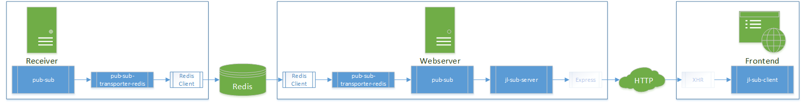

# bvd-intercom

> Prototype Setup to experiment with the pub/sub data pipeline from two backend servers to a client
> (more details can be found in the Background section)

## Installation & Startup

> Requirements: docker, docker-compose, node.js (npm)

1. Clone Repository & Enter Directory  
  `git clone https://github.com:twittwer/bvd-intercom.git`  
  `cd bvd-intercom`
1. Install Dependencies  
  `npm install`
1. Start Application Setup (Redis, Receiver, 2x Webserver, Nginx)  
  `npm start`
1. Open Browser & Navigate to `https://localhost:8080/`  
  (Receiver is listening at `https://localhost:8080/receiver`)
1. Generate and Send Dummy Data  
  `cd load-generator && npm install`  
  `node index.js 1500 counter,temperature=temperature,news=text`  
  (read `load-generator/README.md` for more details)

## Usage

### Submit Data to Receiver

- send a POST request
  - url: `https://localhost:8080/receiver/api`
  - body:

    ```json
    {
      "channel": "channelName",
      "msg": "dataString or dataObject"
    }
    ```

  - samples:

    ```bash
    POST https://localhost:8080/receiver/api
    {
      "channel": "temperature",
      "msg": "21°C"
    }
    ```

    ```bash
    POST https://localhost:8080/receiver/api
    {
      "channel": "weather",
      "msg": {
        "temperature": "21°C",
        "humidity": "84%"
      }
    }
    ```

### Frontend Behavior

- the main switches are located in the constructor of `www/client/src/ChannelCluster.js`
  - `this.log: boolean` - on/off for management log information, like online mode or heartbeat 
  - `this.logData: boolean` - on/off for logging of incoming data
  - `this.autoReconnect: boolean` - activation of reconnect after a disconnect of jlSubClient
  - `this.maxResponseBufferSizeInMB: number|null` - fuzzy limitation of response buffer size (default: 50)*
- after variable changes the client code needs to be rebuilt  
  `cd www/client`  
  `npm run build`

> *) 0.005 is a good limit to observe the reconnect handling

### Scaling

- `npm start` scales to 1 receiver and 2 webserver  
  => `docker-compose up --scale www=2 --scale receiver=1 -d`
- steps to change scaling:
  - change scale of docker-compose service
  - adopt the changes in the Nginx configuration (`nginx-config/nginx.conf`)
  - reboot setup to activate settings: `npm run reboot`

## Background

This prototype setup was built to demonstrate the possibilities of HTTP Streaming in combination with NDJSON for pub/sub scenarios between client and server.  
The setup contains several building blocks. Together they provide a server side pub/sub system with the ability to subscribe to it from the frontend.  
The following block & image are trying to show the abstracted data flow in the sample setup:

```text
DATA (data package client(frontend) has subscribed to; sent via POST request)
 |
 `-> Backend
     |
     `-> Receiver (receives data via HTTP)
         |-> processing of HTTP request (e.g. via express)
         |-> pub-sub (publish)
         |-> pub-sub-transporter-redis (publish)
         |-> Redis Client (publish)
     |<--´
     |
     |<> Redis
     |
     `-> Webserver (serves frontend and exposes REST/Subscribe API)
         |-> Redis Client
         |-> pub-sub-transporter-redis (subscribed)
         |-> pub-sub (subscribed)
         |-> jl-sub-server (subscribed)
         |-> json-lines
         |-> open HTTP request
 |<------´
 |
 `-> Frontend
     |-> jl-client
     |-> jl-receiver
     |-> jl-sub-client
     |
     `-> DATA can be displayed
```


